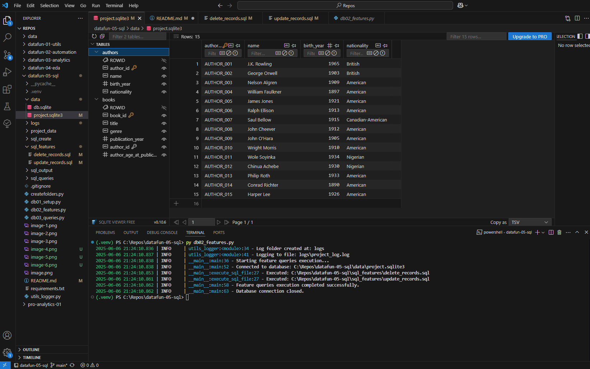
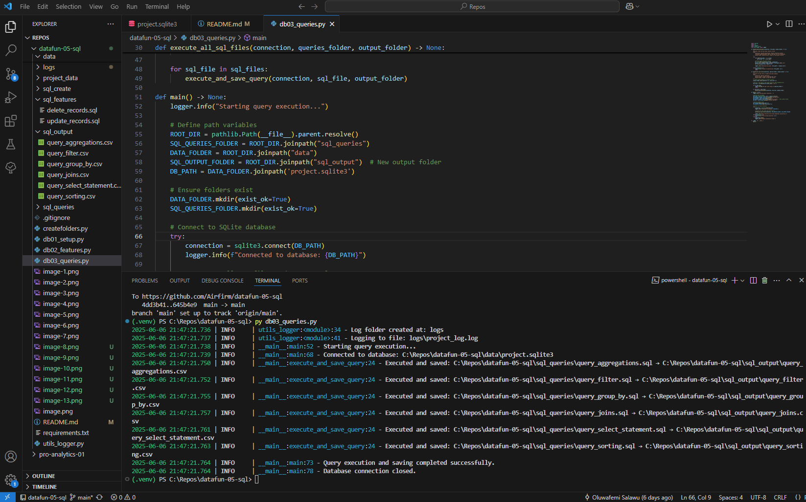
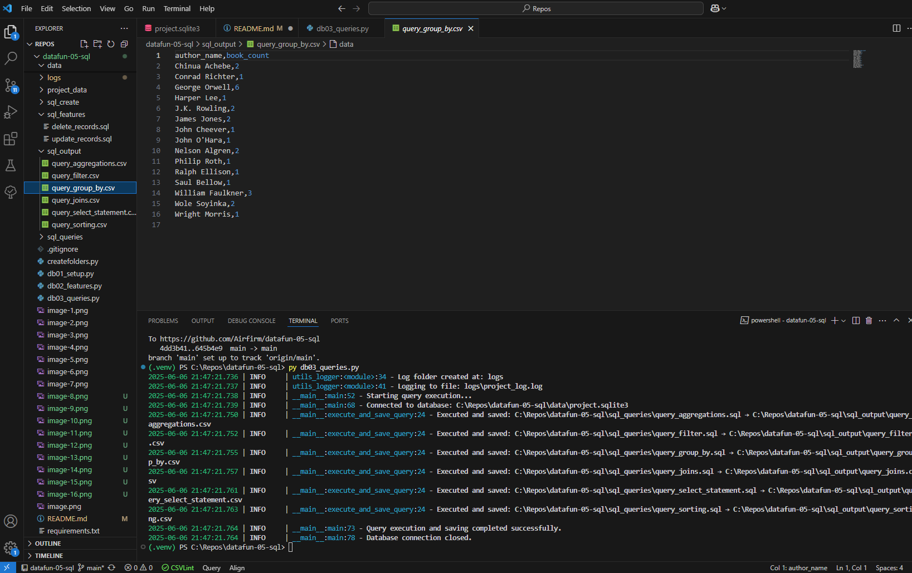

# Start a Python/SQL Project

## Author: Oluwafemi Salawu
### Project Repo Folder: datafun-05-sql

### db01_setup.py
Created a db01_setup.py to run a script that drops if existed and creates a sqlite database, creates tables (authors and books) and insert records

### db02_features.py
Created a db02_features.py file to delete records and also alter and update records in the table; e.g., add a new column (author's age at publication!)

### db03_queries.py
Updated all my query files under sql_queries folder
I created a python script that creates a new sql_queries folder if none existed. 
Then run all the query files in the folder.
Created a new sql_output folder to save the outputs of each queries in their respective csv files

# Screenshots:
drop table if exist

create tables

insert records

tables created and records inserted


deleted record

altered and updated records

a record deleted and new column added to the books table

a record deleted from authors table


aggregation

filter

group by

join

select statement

sorting / order by


db03_queries.py run completed successfully

aggregation query response

filter query response

group by query response

select statement

order by


# Project Description:
We'll use Python to create and manage the overall database. 
We'll use SQL to interact with the relational data and tables. 
Our DBMS is SQLite, a lightweight, file-based database widely used in browsers, mobile devices, and more. 
We'll might use several packages from the  Python Standard Library:
csv - optional - I personally prefer using pandas as the code is a bit cleaner
pathlib
sqlite3
uuid - optional - utility for creating unique ids (helpful with databases)
We'll also add an external dependency (e.g. pandas), so we'll need to create a project-specific virtual environment using venv and pip. 
pandas to read from csv with cleaner code

# SQL FILE:
-- Start by deleting any tables if the exist already
-- We want to be able to re-run this script as needed.
-- DROP tables in reverse order of creation 
-- DROP dependent tables (with foreign keys) first
-- Makes the script idempotent (rerunnable) using the most current statements each time we run

DROP TABLE IF EXISTS books;
DROP TABLE IF EXISTS authors;

-- Create the authors table 
-- Note that the author table has no foreign keys, so it is a standalone table

CREATE TABLE authors (
    author_id TEXT PRIMARY KEY,
    first_name TEXT,
    last_name TEXT,
    year_born INTEGER
);

-- Create the books table
-- Note that the books table has a foreign key to the authors table
-- This means that the books table is dependent on the authors table
-- Be sure to create the standalone authors table BEFORE creating the books table.

CREATE TABLE books (
    book_id TEXT PRIMARY KEY,
    title TEXT,
    year_published INTEGER,
    author_id TEXT,
    FOREIGN KEY (author_id) REFERENCES authors(author_id)
);


# Specification for Project 5 SQL Module

## Overview

Project 5 integrates Python and SQL,
focusing on database interactions using SQLite.
The project involves creating and managing a database, building a schema, and performing various SQL operations,
including queries with joins, filters, and aggregations.

---

## Step 1: Start Project, Open in VS Code

Start a project as usual. 
1. Create a repo in GitHub with a default README.md. Name the repo **datafun-05-sql**. 
2. Clone your new repo down to the Projects folder on your machine. 
3. Open your new project repository folder in VS Code.

---

## Step 2: Add/Update Critical Files

With your new project repo folder open in VS Code, add/update critical project files at the start of every project. 

### Add/Add .gitignore

- The .gitignore file tells Git files to ignore when committing changes.
- Review/copy the example .gitignore file, you might be able to use it without modification.

### Add/Update requirements.txt

- The requirements.txt file lists the packages used in the project.
- Review/copy the example requirements.txt file, you might be able to use it without modification.
- You may not need all the listed packages - and may want to add others. Modify the requirements.txt as needed.

### Update README.md

- Edit and customize your README.md to provide an overview of the project and instructions for running it.
 
### Git add-commit-push

After adding .gitignore (or any other key file), run git add, commit, and push to commit your changes to GitHub. 

```shell
git add .
git commit -m "Add .gitignore and requirements.txt"
git push -u origin main
```

---

## Step 3: Set up Virtual Environment

Next, create and activate a virtual environment for this project. 
Also install additional dependencies required for this project.
See [requirements.txt](requirements.txt) for detailed instructions. 

A. Create .venv
B. Activate .venv
C. Install dependencies into .venv
D. Select VS Code interpreter to use .venv

## Step 4: Schema Design and Database Initialization

Design a schema with at least two related tables, including foreign key constraints.
Document the schema design in your README.md.

sql_create folder:

- 01_drop_tables.sql - drop tables to restart
- 02_create_tables.sql - create your database schema using sql 
- 03_insert_records.sql - insert at least 10 additional records into each table.

db01_setup.py:

Create a Python script that demonstrates the ability to create a database, define a schema, and insert records. 
Make it easy to re-run by dropping the tables first.


## Step 5. Cleaning and Feature Engineering

Implement SQL statements and queries to perform additional operations and use Python to execute your SQL statements.
You might create an additional table, insert new records,
and perform data querying (with filters, sorting, and joining tables),
data aggregation, and record update and deletion.

sql_features folder:

1. update_records.sql - update 1 or more records in a table.
2. delete_records.sql - delete 1 or more records from a table.

db02_features.py

Create a Python script that demonstrates the ability to run sql scripts 
to interact with fields, update records, delete records, and maybe add additional columns. 


## Step 6. Perform Aggregations and queries

Implement SQL statements and queries to perform aggregations and queries.

sql_queries folder: 

1. query_aggregation.sql - use aggregation functions including COUNT, AVG, SUM.
2. query_filter.sql - use WHERE to filter data based on conditions.
3. query_sorting.sql - use ORDER BY to sort data.
4. query_group_by.sql - use GROUP BY clause (and optionally with aggregation)
5. query_join.sql - use INNER JOIN operation and optionally include LEFT JOIN, RIGHT JOIN, etc.

Use Python to execute the SQL queries and maybe chart, illustrate, and/or summarize your findings:

db03_queries.py